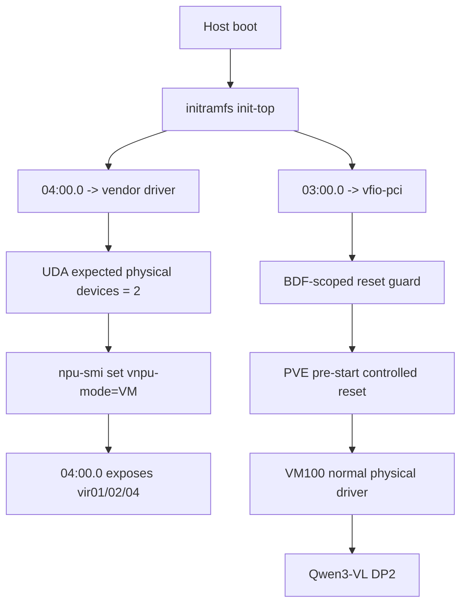

# Atlas 300I Duo 混合模式：一张整卡 VFIO 与一张卡 vNPU 共存

[English](en/ascend-310p-mixed-mode-pve.md)

## 1. 目标与实测结论

在同一台 Kunpeng 920/PVE ARM64 主机上部署两张 Atlas 300I Duo：

- `0000:03:00.0` 从 initramfs 阶段绑定 `vfio-pci`，整卡直通 VM100；
- `0000:04:00.0` 留给宿主 Ascend 驱动，提供 PVE mdev/vNPU；
- VM100 中两颗物理 310P3 以 `DP=2 / TP=1` 运行 Qwen3-VL-4B；
- OCR 继续在 Guest CPU 上运行，统一网关同时提供 OCR 与 Qwen。

实机最终状态：

| 项目 | 结果 |
| --- | --- |
| 物理卡 | `03:00.0 -> vfio-pci`，Guest `/dev/davinci0/1` Health OK |
| vNPU 卡 | `04:00.0 -> devdrv_device_driver`，`vir01=7 / vir02=3 / vir04=1` |
| Guest | openEuler 24.03 LTS SP3，Ascend 25.2.0 normal 驱动 |
| 模型 | Qwen3-VL-4B W8A8SC，DP2/TP1 |
| PVE VM | `hostpci0: 0000:03:00.0,driver=keep` |
| 启停 | 两轮 pre-start 受控 reset 与 Guest 重启通过 |

这是特定驱动、内核和硬件拓扑上的工程验证，不代表厂商通用支持承诺。

## 2. 为什么直接混用会失败

### 2.1 vNPU mode 命令实际作用于全部宿主可见卡

`npu-smi set -t vnpu-mode -d 0/1` 的 `-i` 参数不会限制设置范围。只要两张卡
均由宿主驱动管理，切换 Docker/VM mode 就会同时改变两张卡。normal 物理卡
Guest 随后会报：

```text
Wait boot mode from bios time out
Device probe failed
```

因此物理卡必须在执行 VM-mode 命令前从宿主驱动中隐藏。

### 2.2 运行时解绑已经太晚

宿主厂商驱动一旦在开机时探测 `03:00.0`，就已经将设备启动为 vNPU boot
mode。之后再解绑到 VFIO，Guest normal 驱动仍不能接管。解决方法是在
initramfs `init-top` 阶段按 BDF 设置 `driver_override=vfio-pci`。

### 2.3 UDA 默认把 NUMA 节点数当成物理芯片数

F30 主机有 4 个 NUMA 节点，Ascend UDA 原逻辑因此等待 4 颗芯片。隐藏一张
Duo 卡后，宿主只能探测到另一张卡的 2 颗芯片，`npu-smi` 会等待 150 秒：

```text
uda_wait_all_phy_startup: Wait timeout. (dev_num=2; uda_detected_dev_num=4)
```

增量补丁
[`ascend310p-mixed-mode-uda-count.patch`](../patches/ascend310p-mixed-mode-uda-count.patch)
增加只读模块参数 `uda_expected_phy_dev_num`。默认 0 保持原行为，本机配置为 2。

### 2.4 reset 重枚举时不能让厂商驱动抢占

310P bus reset 后会短暂变成 `1000:02b2`，再恢复 `19e5:d500`。混合模式的
pre-start hook 在 reset 期间临时设置 `drivers_autoprobe=0`，待最终设备出现后
再写入 `driver_override=vfio-pci` 并手工 probe。这样 `03:00.0` 不会再次进入
宿主 vNPU boot mode，`04:00.0` 也不会被复位。

## 3. 启动链



## 4. 关键配置

`/etc/default/ascend310p-vfio`：

```text
ASCEND_VFIO_BDFS=0000:03:00.0
ASCEND_VNPU_BDFS=0000:04:00.0
ASCEND_SET_VNPU_VM_MODE=1
```

`/etc/modprobe.d/ascend310p-no-bus-reset.conf`：

```text
options ascend310p_no_bus_reset target_bdfs=0000:03:00.0
```

`/etc/modprobe.d/ascend-uda-mixed.conf`：

```text
options ascend_uda uda_expected_phy_dev_num=2
```

VM100：

```text
hostpci0: 0000:03:00.0,driver=keep
hookscript: local:snippets/pve-ascend310p-hook
memory: 32768
```

必须禁用原来会对所有卡设置 VM mode 的服务：

```bash
systemctl disable ascend-vnpu-vm-mode.service
systemctl enable ascend310p-mixed-mode-bind.service
systemctl enable ascend310p-vfio-reset-guard.service
```

initramfs 文件：

```text
/etc/initramfs-tools/hooks/ascend310p-mixed-vfio
/etc/initramfs-tools/scripts/init-top/ascend310p-mixed-vfio
```

更新后必须核对镜像内包含配置、init-top 脚本和 `vfio-pci.ko`：

```bash
update-initramfs -u -k "$(uname -r)"
lsinitramfs "/boot/initrd.img-$(uname -r)" | grep -E 'ascend310p|vfio-pci'
```

## 5. 验收

宿主：

```bash
systemctl is-active ascend310p-mixed-mode-bind.service
systemctl is-active ascend310p-vfio-reset-guard.service
lspci -nnk -s 03:00.0 -s 04:00.0
cat /sys/module/ascend_uda/parameters/uda_expected_phy_dev_num
cat /sys/module/ascend310p_no_bus_reset/parameters/target_bdfs
```

期望：

- `03:00.0` 为 `vfio-pci`，`reset_method` 为空；
- `04:00.0` 为 `devdrv_device_driver`，`reset_method=bus`；
- UDA 参数为 2，reset guard 目标仅为 `0000:03:00.0`；
- `04:00.0` 的模板为 `7/3/1`。

Guest：

```bash
grep '^Driver_Install_Mode=' /etc/ascend_install.info
ls -l /dev/davinci0 /dev/davinci1
npu-smi info
curl -fsS http://127.0.0.1:8000/health
curl -fsS http://127.0.0.1:8001/health
```

实测临时创建一个 `vir01` 后，available 从 7 变为 6；删除后恢复为 7，证明
物理直通 VM 运行期间另一张卡仍能完成 mdev 创建/删除。

两轮 hook 验证结果：

- `03:00.0: resetting` 共 2 次，每次只发生在 pre-start；
- 每次重枚举均直接绑定 `vfio-pci`，厂商驱动命中次数为 0；
- 无 `No such host device`、`internal-error`；
- `drivers_autoprobe` 最终恢复为 1；
- `04:00.0` 全程保持 `7/3/1`。

## 6. 性能

| 用例 | 双 vir04 DP2 | 一张整卡物理 DP2 |
| --- | ---: | ---: |
| 295 completion tokens，单请求 | 12.128 s | 9.341 s |
| 单请求端到端生成率 | 约 24.3 tokens/s | 31.6 tokens/s |
| 两个 295-token 请求并发 | 未测 | 10.609 s |
| 双并发聚合生成率 | 约 40 tokens/s（其他用例） | 55.6 tokens/s |
| 自动 OCR，29 行 | 1.503 s | 1.526 s |
| OCR + Qwen 简短混合分析 | 5.414 s | 4.576 s |

OCR 使用 CPU，因此整卡切换不改变 OCR 性能；收益集中在 Qwen decode 和
混合分析。

## 7. 回退

变更前应保留 VM 快照和宿主配置。当前实机回退点为：

```text
VM snapshot: pre-mixed-npu-20260901
Host backup: /root/rollback/ascend-mixed-20260901T002427Z
```

回退顺序：

1. 停止 VM100，禁用 mixed-mode/reset-guard 服务；
2. 移除 initramfs 早绑定脚本并重新生成 initramfs；
3. 恢复原 Ascend UDA 源码/模块，删除 `ascend-uda-mixed.conf`；
4. 清除 `03:00.0` 的 driver override，恢复宿主厂商驱动；
5. 恢复 VM 双 `vir04` 配置和 `vnpu_guest` 驱动快照；
6. 重新启用 `ascend-vnpu-vm-mode.service`；
7. 如需完全回退，再安装保存的官方 QEMU 包并解除 apt hold。

不要在 VM 运行时修改 PCI 绑定、DKMS guard 或 UDA 模块。
