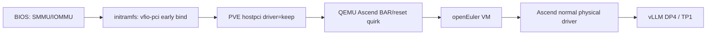

# Atlas 300I Duo 整卡直通：PVE ARM64 适配与性能验证

[English](en/ascend-310p-vfio-pve.md)

## 1. 目标与结论

本文记录在鲲鹏 920 + Proxmox VE ARM64 上，将两张 Atlas 300I Duo
以 VFIO 整卡方式交给同一台虚拟机，并在 Guest 中识别 4 个 Ascend 310P3
芯片的完整修复方法。

实机最终状态：

- 两个 PCIe PF 均由宿主机 initramfs 提前绑定到 `vfio-pci`。
- PVE 启动 VM 时不再重绑或复位设备。
- DKMS guard 为 310P 设置内核 `PCI_DEV_FLAGS_NO_BUS_RESET`，阻止 VFIO
  在最后一个 fd 关闭后执行 bus-reset fallback。
- PVE `pre-start` hook 在 QEMU 打开 VFIO 前执行一次受控复位，并等待设备、
  driver 和 IOMMU group 稳定后才继续启动。
- QEMU 保护双芯片卡 BAR2 中的 xloader 更新寄存器，并跳过不安全的总线复位。
- openEuler Guest 使用物理卡驱动识别 `/dev/davinci0`～`/dev/davinci3`，
  4 个芯片均为 `Health: OK`。
- Qwen3-VL-4B TP1 权重以 `DP=4, TP=1` 运行，单请求平均约 13.95 秒，
  4 并发总耗时 14.03～14.36 秒，吞吐提升约 3.89～3.98 倍。

这是特定软硬件组合的工程验证结果，不是华为或 Proxmox 的通用兼容承诺。

一张卡整卡直通、另一张卡保留 vNPU 的部署与额外 UDA/initramfs 约束见
[Atlas 300I Duo 混合模式](ascend-310p-mixed-mode-pve.md)。同一 PF 内仍不能
同时使用整卡 VFIO 与 mdev。

## 2. 实测基线

| 项目 | 实测配置 |
| --- | --- |
| 服务器 | AArch64，双路 Kunpeng 920 |
| PVE | 9.2.9 ARM64 |
| 内核 | `7.0.14-6-pve` |
| QEMU | `pve-qemu-kvm 11.0.3-1+ascend2` |
| 加速卡 | 2 张 Atlas 300I Duo |
| PCI ID | `19e5:d500`，实测 subsystem device `0x0110` |
| Guest | openEuler 24.03 LTS SP3，16 vCPU，48 GiB RAM |
| Guest 驱动 | Ascend 25.2.0，`normal` 物理卡模式 |
| 模型 | Qwen3-VL-4B-Instruct W8A8SC，vLLM TP1 sharded state |

## 3. 数据路径



整卡直通与 vNPU/mdev 是两套互斥路径。整卡直通时不要加载宿主 Ascend
业务驱动、不要启用 vNPU VM 模式服务，也不要同时从同一 PF 创建 mdev。

## 4. 原始失败机制

### 4.1 BAR2 xloader 寄存器

Atlas 310P 虚拟机配置需要保护 BAR2 内的 xloader 更新寄存器。双芯片卡有
两个目标地址：

```text
chip0: BAR2 + 0x00100430
chip1: BAR2 + 0x08100430
```

QEMU 应允许 Guest 读取真实值，但拦截写操作。通用 QEMU 11 没有该设备专用
quirk，因此需要应用本仓库补丁。

### 4.2 PCI reset 会让端点重新枚举

实测对 `19e5:d500` 执行通用 PCI bus reset 后，链路会 Down/Up，设备短暂以
`1000:02b2` 出现，再重新枚举为 `19e5:d500`。期间会发生：

- 原 sysfs 设备和 IOMMU group 消失；
- `/dev/vfio/<group>` 删除并重新创建；
- QEMU 已打开的 VFIO fd 失效；
- PVE 启动可能报 `No such host device`、`No such file or directory` 或
  `internal-error`。

复位来源不只有 QEMU。PVE `prepare_pci_device()` 默认会在启动前通过 sysfs
执行一次 reset；Linux `vfio_pci_core_disable()` 还会在最后一个 VFIO fd
关闭后调用 `vfio_pci_dev_set_try_reset()`。因此仅修改 QEMU 仍不完整。

## 5. 三层修复

### 5.1 QEMU：BAR 写保护和 reset 跳过

应用：

[`pve-qemu-11.0.3-ascend310p-vfio.patch`](../patches/pve-qemu-11.0.3-ascend310p-vfio.patch)

补丁完成两件事：

1. 根据 310P 单芯片/双芯片 subsystem device 范围注册 BAR2 overlay，读取
   透传到硬件，写入被拦截并记录日志。
2. 对 `19e5:d500` 清除 QEMU 的 `needs_reset`，并在设备 reset 回调中直接返回。

必须针对当前 PVE QEMU 源码重新构建 Debian 包，不要安装其他版本生成的二进制：

```bash
cd <pve-qemu-source>
install -m 0644 /path/to/pve-qemu-11.0.3-ascend310p-vfio.patch \
    debian/patches/extra/0026-vfio-pci-protect-Ascend-310P-xloader-registers.patch
printf '%s\n' \
    extra/0026-vfio-pci-protect-Ascend-310P-xloader-registers.patch \
    >> debian/patches/series

# 更新 debian/changelog 后构建。
DEB_BUILD_OPTIONS="parallel=$(nproc) nocheck" make deb
sudo dpkg -i ./pve-qemu-kvm_<version>_arm64.deb
```

安装后可确认二进制包含两个关键日志字符串：

```bash
strings /usr/bin/qemu-system-aarch64 | \
    grep -E 'blocked write to Ascend 310P|skipping unsafe Ascend 310P'
```

### 5.2 宿主：提前绑定 vfio-pci

`/etc/modprobe.d/ascend310p-vfio.conf`：

```text
options vfio-pci ids=19e5:d500 disable_idle_d3=1
blacklist drv_vascend
```

向 `/etc/initramfs-tools/modules` 加入：

```text
vfio
vfio_iommu_type1
vfio_pci ids=19e5:d500 disable_idle_d3=1
```

更新 initramfs 并重启宿主：

```bash
update-initramfs -u -k all
systemctl disable --now ascend-vnpu-vm-mode.service 2>/dev/null || true
reboot
```

重启后两个 PF 都应显示 `Kernel driver in use: vfio-pci`。

### 5.3 PVE 与内核：`driver=keep` 和双层 reset guard

PVE 原生支持 `hostpci driver=keep`。该选项明确表示不重绑设备，也不执行
PVE 启动前 reset；前提是设备已经由 initramfs 正确绑定到 `vfio-pci`：

```bash
qm set <VMID> --hostpci0 <BDF0>,driver=keep
qm set <VMID> --hostpci1 <BDF1>,driver=keep
```

安装 DKMS bus-reset guard。该模块为当前及后续重新枚举的 `19e5:d500`
设置 Linux 原生 `PCI_DEV_FLAGS_NO_BUS_RESET`：

```bash
apt install -y dkms psmisc proxmox-headers-$(uname -r)
sudo ./scripts/install-ascend310p-no-bus-reset.sh
```

安装或更新 guard 前必须停止所有占用 310P VFIO group 的 VM；安装脚本检测到
任一 group 仍被打开时会直接拒绝操作。

再安装 systemd reset guard。服务会先加载上述模块，再清空 PCI function
reset method：

```bash
install -m 0755 scripts/ascend310p-vfio-reset-guard \
    /usr/local/sbin/ascend310p-vfio-reset-guard
install -m 0644 systemd/ascend310p-vfio-reset-guard.service \
    /etc/systemd/system/ascend310p-vfio-reset-guard.service
systemctl daemon-reload
systemctl enable --now ascend310p-vfio-reset-guard.service
```

两层 guard 均动态匹配所有 `19e5:d500`，不写死 PCI 地址，并在
`pve-guests.service` 前就绪。只清空 `reset_method` 不够，因为 VFIO close
仍可能尝试 bus-reset fallback；只设置 `NO_BUS_RESET` 也不替代 function
reset 防护。

完全禁止 reset 后，Guest 第二次启动可能继承上一轮设备运行态。因此还要安装
受控预启动流程：

```bash
install -m 0755 scripts/ascend310p-vfio-prepare \
    /usr/local/sbin/ascend310p-vfio-prepare
install -d -m 0755 /var/lib/vz/snippets
install -m 0755 scripts/pve-ascend310p-hook \
    /var/lib/vz/snippets/pve-ascend310p-hook
qm set <VMID> --hookscript local:snippets/pve-ascend310p-hook
```

`pre-start` hook 会：

1. 临时卸载 DKMS guard，逐卡启用并执行 bus reset；
2. 必须观察旧 sysfs inode 消失或变化，避免把 reset 前节点误判为新节点；
3. 等待 `19e5:d500`、`vfio-pci`、IOMMU group 和 `/dev/vfio/<group>` 连续稳定；
4. 重新加载 DKMS guard、清空 function reset method，再将控制权交给 QEMU。

`post-stop` 不复位设备，避免 QEMU fd 关闭阶段发生异步重新枚举。
prepare 脚本会检查宿主上的全部 310P VFIO group；只要还有其他 VM 占用任一
group，就拒绝临时卸载全局 guard 和执行 reset。因此多 VM 场景必须协调停机，
不能并行启动分别占用不同 310P PF 的 VM。

## 6. Guest 驱动

整卡直通必须安装物理卡驱动，不是 `vnpu_guest`：

```bash
./Ascend-hdk-310p-npu-driver_<version>_linux-aarch64.run \
    --full --install-for-all --quiet
```

验证安装模式和设备：

```bash
grep '^Driver_Install_Mode=' /etc/ascend_install.info
ls -l /dev/davinci{0,1,2,3}
npu-smi info
```

期望 `Driver_Install_Mode=normal`，4 个 310P3 芯片均为 `Health: OK`。

## 7. Qwen3-VL 四路数据并行

当前 W8A8SC 文件是 vLLM TP1 `sharded_state`，量化权重已使用
`FRACTAL_NZ` 单卡布局。它不能通过普通 safetensors loader 直接切成 TP4；
强行切分会出现参数名重复或张量维度越界。

正确方式是复制 4 个 TP1 引擎，并由一个 API 入口内部负载均衡：

```text
ASCEND_RT_VISIBLE_DEVICES=0,1,2,3
TENSOR_PARALLEL_SIZE=1
DATA_PARALLEL_SIZE=4
API_SERVER_COUNT=1
LOAD_FORMAT=sharded_state
```

本仓库 [`examples/qwen3-vl-310p`](../examples/qwen3-vl-310p/) 已支持按
`ASCEND_RT_VISIBLE_DEVICES` 动态挂载多个 `/dev/davinci*`。

实测 32 GiB Guest 在四路引擎同时加载时触发 OOM，48 GiB 可稳定运行，模型
就绪后约有 11 GiB 可用内存。首次启动需等待四路编译和视觉预热，应以
`/health` 返回 HTTP 200 为准。

## 8. 性能结果

测试使用同一图片请求：871 prompt tokens，384 completion tokens，
`finish_reason=length`。

| 模式 | 单请求平均 | 4 并发总耗时 | 聚合吞吐 |
| --- | ---: | ---: | ---: |
| `vir04` vNPU，TP1 | 约 17.89 s | 未测 | 约 0.0559 req/s |
| 整卡单芯片，TP1 | 约 13.51 s | 未测 | 约 0.0740 req/s |
| 两卡四芯片，DP4/TP1 | 13.948 s | 14.030～14.362 s | 0.2785～0.2851 req/s |

DP4 相对其单请求基线的吞吐提升约为 3.885～3.977 倍；它不会把一个请求拆到四颗芯片，
因此单请求延迟基本不变。若需要 TP4，必须取得或重新生成与 TP4 匹配的量化
权重，并重新验证跨芯片通信开销。

## 9. 验收清单

宿主：

```bash
dpkg-query -W pve-qemu-kvm
lspci -nnk | grep -A3 '19e5:d500'
systemctl --no-pager status ascend310p-vfio-reset-guard.service
dkms status -m ascend310p-no-bus-reset
lsmod | grep ascend310p_no_bus_reset
qm config <VMID> | grep -E 'hostpci|memory|onboot'
```

Guest：

```bash
npu-smi info
systemctl --no-pager status vision-qwen3vl.service
curl -fsS http://127.0.0.1:8000/health
```

必须执行至少两轮 `qm shutdown` + `qm start`。每次 `pre-start` 输出中，两张卡
都应报告 `is ready in IOMMU group`。受控启动阶段出现一次 Link Down/Up 是
预期行为；关机阶段不应出现新的 reset 或 Link Down。可在关机前后对比：

```bash
journalctl -k -b --no-pager | \
    grep -E 'vfio-pci .* resetting|pciehp: .* Link Down'
```

关机阶段新增匹配应为 0。QEMU 日志中可以出现
`skipping unsafe Ascend 310P bus reset`；hook 报告设备 ready 之后，不应再出现
额外链路 Down/Up、`No such host device` 或 `/dev/vfio/<group>` 丢失。

## 10. 边界与回退

- PVE/QEMU 或内核升级后，补丁必须重新移植、构建和执行 VM 启停回归。
- DKMS 会为新内核自动重建 guard，但仍须确认构建成功并重新执行关机后的
  reset/Link Down 日志检查。
- 保存官方 QEMU Debian 包用于回退；不要只备份单个 QEMU 二进制。
- 从整卡直通切回 vNPU 前，应先停止 VM，移除整卡 `hostpci`，恢复宿主 Ascend
  驱动和 VM 模式服务，不能让两种模式同时占用同一 PF。
- 本仓库不分发厂商驱动、模型、固件、证书或 API 密钥。
